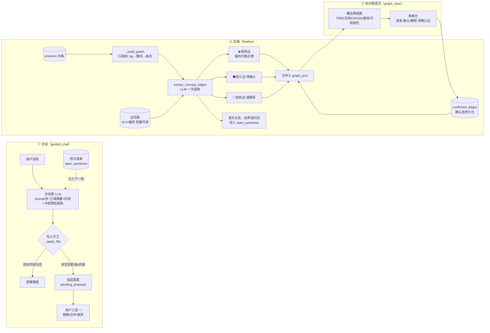
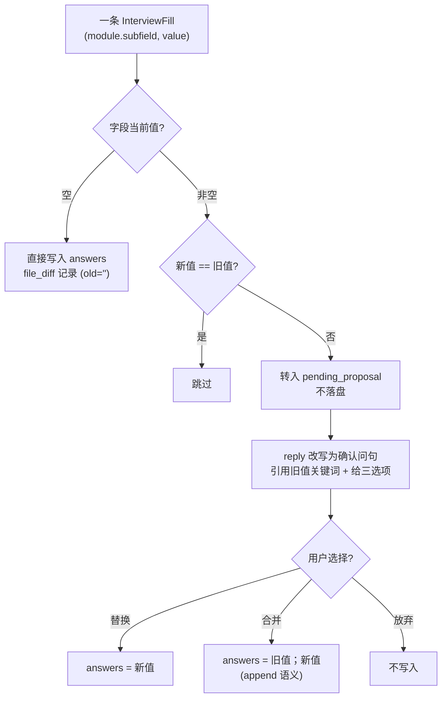
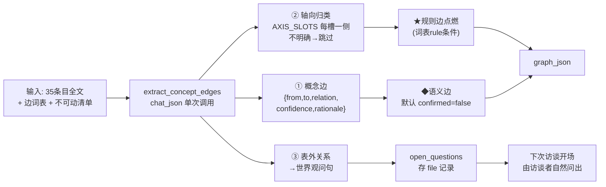
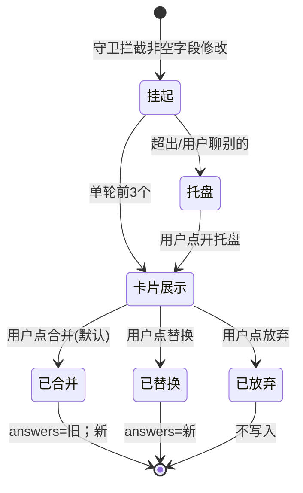

# A1 引导审核流与概念网 — 需求与设计文档

> **一句话**：AI 提想法前先查冲突、不踩已定红线；一切修改用户有最终审核权；工坊第二页（知识图谱页）从"行政树"升级为"概念网"——能看见条目之间的现状关系。

---

## 1. 背景：实测暴露的三个缺口

2026-08-28 用 `明华修仙.txt` 对 A1 三态流做的全链路实测（DeepSeek deepseek-v4-pro，11 次调用）：

| # | 实测现象 | 根因 |
|---|---|---|
| G1 | 用户补充"观明宗"一条信息，**3 个已填核心设定被整体覆盖**（灵韵海化生万物→"第三层地壳的阴面"），违反文档自身 `immutable_core` 边界 | `_apply_fills` 无条件直写（guide_engine.py:141）；prompt 注入了旧答案却没有任何保护规则 |
| G2 | 定稿图谱 46 节点/45 边**全部是 TREE 行政包含边**，0 条 CROSS、0 个约束节点——"明珠↔九层嵌套↔向地核"等强语义关联在图中无任何表达 | 概念边层从未存在；`tag=` 片段协议两条填充路径都不产 |
| G3 | 结构化 `divergent_question` 四轮访谈均未触发；深化时追问已填字段 | prompt 规则9已写明但 LLM 未执行；无代码级兜底 |

**用户需求即针对 G1（审核权）、G2（概念网）、G3 顺带修复（发散引导兜底）。**

---

## 2. 需求清单（R）

| ID | 需求（用户原意） | 验收要点 |
|----|----|----|
| R1 | AI 提出想法前，**不得与之前的设定冲突** | 提案前对照全部已填答案做冲突预检；冲突→用世界观语言指出冲突点 |
| R2 | **不出现前面定过、后面又踩红线的内容** | `设定边界.immutable_core` 作为最高优先级上下文常驻注入；违反即拒绝提取 |
| R3 | AI **可以提想法**，但**用户有最终审核权** | 非空字段的一切修改走 提案→确认 流；不确认不落盘 |
| R4 | 知识图谱页要能看到**现状的条目关系**，生成**概念网**（网状） | 图谱页渲染条目间语义边；非纯层级树 |
| R5 | 以 **v0.4 概念树为拓扑参考系** | 边词表从 v0.4 §3 派生边总表编译；★规则/◆语义/◇结构 三级可信 |
| R6 | 出现**表外新关系必须询问用户**，且用**用户能听懂的同世界观语言**（禁用"拓扑/槽位/派生"等术语） | 表外关系→世界观式问句→访谈中问出→用户答后成边 |

---

## 3. 总体架构



**三态流不变**（种子→访谈→定稿→图谱），新增组件全部是插入件：守卫在 `_apply_fills`，抽取在 `_build_graph` 之后，审核在图谱页。

---

## 4. 模块一：引导填补改造（对应 R1/R2/R3/R6-语言）

### 4.1 写入守卫（代码级铁律，不依赖 LLM 自觉）



**确认问句范式**（世界观语言，禁术语）：
> "你之前定过【特殊地理】是『灵韵海在最中心，化生万物』。这次的『第三层地壳的阴面』——是要**替换**它，还是两者**并存**（同一条里都保留），还是先**放弃**这条修改？"

### 4.2 Prompt 规则变更（interviewer._build_prompt）

在现有规则 3 与 4 之间插入：

| 新规则 | 内容 |
|---|---|
| 冲突预检 | 生成 fills 前逐条对照【用户已确定的内容】：矛盾/窄化（个例替代通例）/重叠（实例冒充类型）→ 该 fill 标记 `conflict_note`（世界观语言），value 仍按用户原意提取，由守卫拦截落盘 |
| 红线记忆 | 【设定边界.不可变集】值以 `【不可动清单】` 标头注入并置顶；与清单冲突的内容拒绝提取，reply 说明与哪条铁律冲突 |
| 术语转译 | 面向用户的一切输出禁用：拓扑/槽位/派生/枚举/轴向/上游下游 → 必须转译为设定式表述（内部 JSON 字段名不受限） |

### 4.3 InterviewResult 模型扩展

```
InterviewFill   + conflict_note: str | None      # 冲突说明（世界观语言）
InterviewResult + proposals: list[Proposal]       # 守卫拦截后转制的提案
Proposal = {module, subfield, old, new, conflict_note, merge_preview}
```

复用现有 `/api/a1/chat/confirm`（choice: `replace|merge|drop`）——确认流基建已在，只补语义。

### 4.4 发散引导兜底（修 G3）

`divergent_question` 为空但本轮 fills 非空时，代码级模板兜底生成一条（从本次 fills 关键词 × 未填字段清单选取），保证 R6 的"问句持续在场"。

---

## 5. 模块二：概念网生成管线（对应 R4/R5/R6-流程）

### 5.1 边词表（`concept_edge_vocab.py`，机器可读常量）

从 v0.4 §3 派生边总表 + §2 槽位策略标注编译：

```python
EDGE_VOCAB = [
  EdgeSpec(name="力量源自",      level="semantic", from_slots=["力量体系.source"], to_slots=["世界本体.origin"], hint="力量源头指向起源设定"),
  EdgeSpec(name="中心位于",      level="semantic", from_slots=["地理空间.terrain"], to_slots=["世界本体.origin"], hint="世界结构的中心=起源物"),
  EdgeSpec(name="争夺焦点",      level="semantic", from_slots=["文明与社会.conflict"], to_slots=["地理空间.special_geo"], hint="冲突围绕的地理目标"),
  EdgeSpec(name="判定映射",      level="rule",     from_slots=["骰子设定.check_mode"], to_slots=["力量体系.acquire"], rule="封闭获取→投低；开放获取→投高"),
  # … v0.4 §3 全量 ★/◆/◇ 编译，封闭词表不允许 LLM 自造边名
]
AXIS_SLOTS = [  # 需轴向归类的槽位（点燃 ★ 规则边用）
  ("世界本体.reality_rule", ["意志主导", "物质主导"]),
  ("力量体系.acquire",      ["封闭精英", "开放众生"]), ...
]
```

### 5.2 抽取流程（finalize 时一次 LLM 调用）



**示例（明华世界预期产出）**：
```
地理空间.terrain ─中心位于→ 世界本体.origin      ◆ "九层嵌套最中心为明珠"
文明与社会.conflict ─争夺焦点→ 地理空间.special_geo ◆ "各方势力都想往地核明珠去"
世界本体.origin ─力量源自→ 力量体系.source         ◆ "明珠映照大道印痕"
骰子设定.probability ←─判定映射─ 世界本体.reality_rule ★ (物质主导→线性d20)
表外: "九层越靠近中心的层，灵韵是不是越浓？" → 待问
```

### 5.3 确认态持久化与降级

- `confirmed_edges` 存 file 记录，键 `(from,to,relation)`；re-finalize 重抽取后匹配恢复确认态
- 抽取 LLM 失败 → finalize **不阻塞**，产出纯 TREE 图 + warning（与现有降级立场一致）
- 表外关系用户回答后 → 下一轮 re-finalize 转正为 ◆ 边

---

## 6. 模块三：图谱页 UI（工坊第二页 = 概念网 + 审核台）

### 6.1 视图设计（现有 A1KnowledgeGraph.tsx 增强）

```
┌─────────────────────────────────────────────────────────────┐
│  [行政树|概念网] 切换   待确认边 3   疑点 1   待问 2          │
├─────────────────────────────────────────────────────────────┤
│                                                             │
│      cst边界                                    IP定位      │
│     ┌─────┐                                    (概念)      │
│     │ L0  │                                      │         │
│     └──┬──┘        ┌────────── 世界本体 ──────────┘         │
│        │           │  ·起源: 明珠照射十方…                   │
│        │      ───力量源自──┐    ▲                           │
│        │                  │    └─中心位于─ 地理空间          │
│   力量体系 ◄──────────────┘         │  ·terrain: 九层嵌套    │
│    ·source: 大道印痕                │                       │
│        ▲                           ▼                       │
│        └─────判定映射★──── 骰子设定 ·check_mode             │
│                                                             │
│   ── TREE 实线紫   -- ◆语义边琥珀虚线(待确认闪烁)            │
│   ⋯★规则边绿色点线   ⋯red 疑点红虚线                        │
└─────────────────────────────────────────────────────────────┘
  概念网模式：按模块分簇 + 语义边织网（force 布局或簇内分层）
```

### 6.2 边渲染规则（复用现有 CROSS 通道）

| 边类 | 样式 | 交互 |
|---|---|---|
| TREE 行政包含 | 紫色实线（现状不变） | 无 |
| ◆ 语义边-待确认 | 琥珀虚线 + 呼吸动画 + `?` 角标 | 点击 → 卡片（rationale + 确认/删除） |
| ◆ 语义边-已确认 | 琥珀实线 | 点击查看 rationale |
| ★ 规则边 | 绿色点线 + 关系名标签 | 点击查看判定依据 |
| 疑点（冲突疑点） | 红色虚线 | 点击查看冲突说明 |
| 待问（表外关系） | 页面顶部清单条目 | "去回答"跳回访谈页 |

### 6.3 新增 API

| 方法 | 路径 | 说明 |
|---|---|---|
| POST | `/api/a1/file/{id}/edge/{key}/confirm` | 确认一条待确认边（写入 confirmed_edges） |
| POST | `/api/a1/file/{id}/edge/{key}/reject` | 删除一条边（记入 rejected，重抽取不再出现） |
| GET | `/api/a1/file/{id}` | 扩展返回 open_questions / edge_stats |

### 6.4 两页交互契约（谁在哪能做什么）

**分工原则：访谈页负责"说"，图谱页负责"看与点选"。全部自由文本输入只存在于访谈页一个通道；图谱页零文本输入框**——设定内容的唯一入口是访谈，杜绝两页都能改数据造成的认知扰乱与状态漂移。

| 页面 | 交互通道 | 用户能做什么 | 不能做什么 |
|---|---|---|---|
| **访谈页** guided_chat | ①自由文本框 ②提案卡片按钮 ③序号回复 | 见 6.5 输入协议表 | — |
| **图谱页** graph_view | ①视图切换（行政树/概念网） ②节点点击（只读详情卡） ③待确认边点击（审核卡：确认/删除按钮） ④可信级/状态筛选 ⑤"去回答"跳转（回到访谈页） ⑥draft 态"一键重新定稿"按钮 | 只点选、只审核 | 不能打字输入任何设定/关系名/批注（改关系名属编辑，留给既有图谱编辑器，见 §10） |

### 6.5 访谈页输入协议（用户能输入什么 → 系统怎么响应）

| # | 输入形态 | 用户示例 | 系统行为 |
|---|---|---|---|
| 1 | 直接回答当前问题 | "这个世界叫明华世界" | 正常 fills 落盘（现状） |
| 2 | 一句话多设定 | "东方仙侠背景，核心体验是逆天改命" | 多字段分解落盘（现状） |
| 3 | **补充触及已填字段** | "观明宗位于第三层阴面…" | 守卫拦截 → 出**提案卡片**（见 6.6），不落盘 |
| 4 | **提案响应-按钮** | 点[替换]/[合并保留两者]/[放弃] | 按选择落盘/放弃 |
| 5 | **提案响应-自然语言** | "两个都要" / "还是算了" / "听你的" | LLM 意图映射到三选一；映射不出（如"嗯"？）→ 重述三选项，**绝不默认替换** |
| 6 | 脚手架序号/跳过 | "2" / "跳过" | 现有 stall-guard 机制 |
| 7 | **回答待问**（表外关系） | "对，越靠近中心灵韵越浓" | open_question 关闭；答案进 answers 供 re-finalize 成边 |
| 8 | 明确拒绝待问 | "这个我没想过，先不谈" | 该待问标记 skipped，不再问 |
| 9 | 提问/闲聊 | "骰子是啥意思？" | 现有：引导回主题 / user_confused 检索 |

**引导明确性铁律**：同一时刻页面上**只有一个问句在等用户**——提案卡片在场时 next_question 挂起（卡片处理完下一轮再问）；待问开场一次只问一条。绝不出现"提案问句+问卷问题+发散追问"三连问。

### 6.6 提案卡片与托盘（防提案轰炸）

```
┌─ 修改提案 (1/2) ────────────────────────────┐
│ ⚠ 与已有设定重叠                             │
│ 字段：特殊地理                               │
│ ┌────────────────────────────────────────┐  │
│ │ 原设定：灵韵海位于最中心，化生万物；阴阳  │  │
│ │ 分割差异导致灵韵分布不同…                │  │
│ │ 新内容：第三层地壳的阴面                  │  │
│ └────────────────────────────────────────┘  │
│ 冲突说明：新内容是一个具体位置，原设定是核心  │
│ 奇观——两者可以并存，不冲突。                  │
│                                             │
│ [替换]  [合并保留两者 ✓默认]  [放弃]          │
└─────────────────────────────────────────────┘
   未处理提案 → 收进右下角「提案托盘 ⚑2」
   （不阻塞访谈，用户随时点开处理）
```

- 单轮触发的提案 **≤3 张**成卡展示，超出的直接进托盘
- 用户不理会提案继续聊别的 → 提案自动进托盘，访谈不中断（托盘红点计数提醒）
- 默认高亮 = **合并**（最安全选项）；"替换"需用户主动点击



### 6.7 防扰乱设计（七条机制）

| # | 扰乱源 | 机制 |
|---|---|---|
| 1 | **双页状态漂移**（访谈改了、图谱还是旧图） | 图谱页顶部状态徽章：`已定稿 v2 ✓` / `⚠ 设定已更新——点此重新定稿查看新图`（一键按钮）；draft 期间显示旧图+徽章，不闪空 |
| 2 | **提案轰炸** | 单轮 ≤3 卡片 + 托盘收纳（6.6）；托盘是唯一堆积处，红点计数 |
| 3 | **概念边过密**（网变毛线球） | 抽取上限 ≤1.5×条目数；筛选器默认只显示 已确认+待确认；已拒绝默认隐藏；悬停高亮邻边，其余淡化 |
| 4 | **待问清单堆积** | 开场一次只问一条（最老的优先）；清单 >5 条时访谈页提醒"有 N 个问题待你拍板，要不要现在过一遍？"；明确跳过 = 永久跳过 |
| 5 | **术语暴露** | 图谱页用户可见文案全走词典：★→"铁律推断"（绿）、◆→"联想"（琥珀）、◇→"结构拆解"（蓝灰）；relation 名用抽取时的中文短语，词表内部名只存数据不出屏 |
| 6 | **误删边** | 删除需二次确认弹层；已删边进"已拒绝清单"（图谱页可展开），同会话内可恢复 |
| 7 | **模糊响应歧义**（用户回"嗯""好"） | 提案在场时模糊回答 → LLM 映射三选一；映射置信度低 → 原样重述三选项；**任何情况下不以沉默/歧义默认"替换"** |

---

## 7. 数据模型变更汇总

| 模型 | 变更 | 兼容性 |
|---|---|---|
| `GraphEdge` | + `relation: str = ""`、`confidence: str = ""`（rule/semantic/structure）、`confirmed: bool = True` | 全部带默认值，旧 JSON 照常反序列化 |
| `InterviewFill` | + `conflict_note: str \| None = None` | 同上 |
| `InterviewResult` | + `proposals: list[Proposal] = []` | 同上 |
| `A1Session` | + `pending_proposals: dict`、`open_questions: list` | 同上 |
| `_FILES` 记录 | + `confirmed_edges`、`rejected_edges`、`open_questions` | 内存态，随会话 |

---

## 8. 验收标准（Given/When/Then）

1. **守卫**：G 已填字段非空 / W 用户补充新内容命中该字段 / T 不落盘、reply 出现三选一问句、confirm 后按选择写入
2. **红线**：G 不可动清单含"之前的设定都不可改动" / W 消息试图整体替换核心设定 / T 拒绝提取并指出冲突对象
3. **概念边**：G 明华修仙.txt 上传+定稿 / T graph_json 含 ≥3 条 ◆ 语义边、CROSS>0、图谱页概念网模式可见网状
4. **规则边**：G 轴向归类成功 / T 对应 ★ 边出现且带判定依据
5. **表外关系**：G 抽取遇到词表外关系 / T 生成无术语问句、进入待问清单、访谈中问出、回答后 re-finalize 成边
6. **审核权**：G 待确认边存在 / T 图谱页可逐条确认/删除，confirmed_edges 跨 re-finalize 保留
7. **降级**：G 抽取 LLM 失败 / T finalize 成功、纯 TREE 图、warnings 非空
8. **回归**：G 上述全部关闭 / T 692 现有测试全绿（新增不破坏旧行为：空字段直填路径不变）
9. **单问句在场**：G 提案卡片在场 / T 同一屏不出现问卷问题或发散追问；提案处理后下一轮才恢复 next_question
10. **零文本图谱页**：G 打开图谱页 / T 页面无任何文本输入框，全部动作为点选
11. **歧义不替换**：G 提案在场、用户回复"嗯"/"好"等模糊语 / T 系统重述三选项，answers 不变
12. **状态徽章**：G 定稿后访谈页又产生新 fills / T 图谱页显示"⚠ 设定已更新"徽章 + 一键重新定稿入口

---

## 9. 实施拆分建议

| 阶段 | 内容 | 依赖 |
|---|---|---|
| P1 | 写入守卫 + 提案卡片/托盘 UI + confirm 流 + prompt 三规则（修 G1，最快见效） | 无 |
| P2 | 边词表编译 + extract_concept_edges + GraphEdge 扩展（概念边进图） | P1 无依赖可并行 |
| P3 | 图谱页概念网视图 + 边审核卡 + 筛选器 + 状态徽章/一键重定稿 + 已拒绝清单 | P2 |
| P4 | open_questions 访谈闭环 + 发散引导兜底 + 疑点角标 | P2/P3 |

---

## 10. 明确不做（YAGNI）

- 不建完整三级语义编译器（semantic_compiler 保持骨架，提案能力嫁接 interviewer）
- 不做答案结构化改造（TREE/DAG 值解析器除存在物列表外暂缓——v0.4 §5 的其余差距留给后续）
- 不做 cst_* 约束节点复活（tag= 片段协议另行立项）
- 概念网不做自由拖拽编辑（只读+审核，编辑留给既有图谱编辑器）
