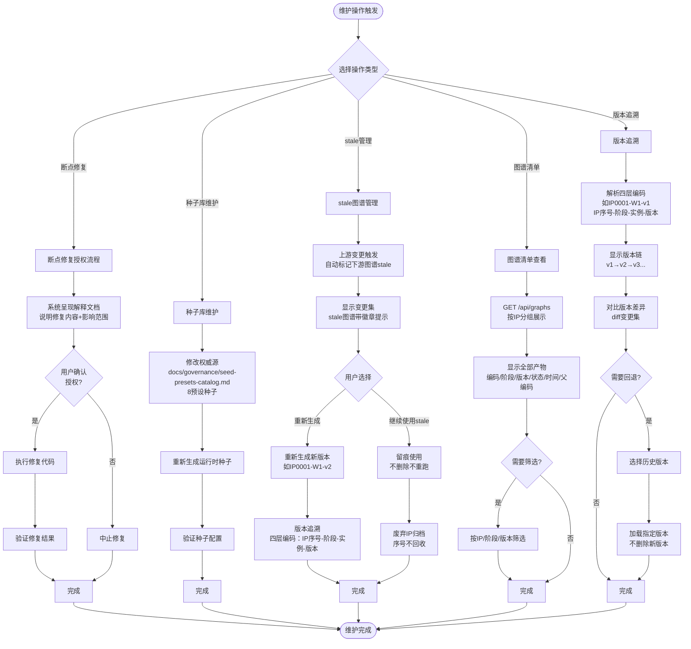

# Echo UGC MVP 需求梳理文档

## 文档说明
- **项目**：Echo UGC - A模块（世界观→策划→内容生产→GM大厅）
- **阶段**：MVP（最小可行产品）
- **目标**：完整实现7个独立生成器+用户全链路操作
- **用户体系**：默认FREE（自动user_id），VIP/SVIP仅预留接口
- **核心约束**：修改不污染、图谱为事实源、stale不阻断

---

## 第一部分：MVP需求总览表

### 用户角色定义

| 用户类型 | MVP权限说明 | 功能差异 |
|---------|------------|---------|
| **免费用户（FREE）** | 默认所有用户，自动分配user_id | 完整使用A1/A2/A3/大厅全链路，策划分析免费完整实现 |
| **订阅用户（VIP/SVIP）** | MVP阶段与FREE完全相同 | UserTier仅枚举预留，路由不分级，后续迭代才实现差异 |
| **维护人员** | 无专门管理后台 | 通过断点修复授权流程+种子库维护+版本追溯 |

> **重要结论**：MVP阶段免费用户和订阅用户操作流程完全一致，无功能差异。VIP/SVIP相关代码仅预留接口（TODO注释），不影响流程。

---

### 功能模块总览

| 模块 | 页面路由 | 核心功能 | 前置条件 | 产出物 |
|-----|---------|---------|---------|--------|
| **身份初始化** | `/` | 自动注册user_id | 无 | user_id（LocalStorage）+ FREE徽章 |
| **A1世界观设计** | `/a1` | 种子选择→访谈→定稿 | 无 | IP序号+结构化文件+图谱（IPxxxx-W1-v1） |
| **A1 IP展板** | `/a1/poster` | 展示已定稿IP | A1已定稿 | IP展板（氛围图+设定浮层） |
| **A2产品策划** | `/a2` | 策划分析→决策→模组生成 | A1图谱 | 骰子/角色/主模组图谱+展板+提示词 |
| **A2展板组** | `/a2/boards` | 查看骰子/角色/主模组展板 | A2已生成 | 展板组+提示词组 |
| **A3内容生产** | `/a3` | 场景扩写+资产生成 | 主模组图谱 | 次级模组图谱（IPxxxx-M1-S1-v1）+资产图片 |
| **GM大厅** | `/lobby` | TRPG游玩界面 | A3资产生成 | 场景图+资产图+角色卡+骰子面板 |

---

### 7个独立生成器

| # | 生成器名称 | 输入 | 输出 | 独立可用性 |
|---|----------|------|------|-----------|
| ① | IP设计生成器 | 种子/自定义想法 | 结构化IP文件+图谱 | ✅ 可独立交付 |
| ② | 策划分析生成器 | A1图谱 | 策划报告+决策 | ✅ 免费可用 |
| ③ | 主模组生成器 | A1图谱（+可选策划） | 主模组图谱+展板 | ✅ 可跳过策划直接生成 |
| ④ | 骰子投影生成器 | A1图谱+策划决策 | 骰子模板图谱 | ✅ 依赖A2流程 |
| ⑤ | 角色投影生成器 | A1图谱+骰子模板 | 角色模板图谱 | ✅ 依赖骰子 |
| ⑥ | 次级模组生成器 | 主模组图谱+扩写参数 | 次级模组图谱+场景清单 | ✅ 独立扩写 |
| ⑦ | 资产生成器 | 次级模组图谱+提示词 | 资产图片（版本化） | ✅ 独立生成 |

> **设计原则**：7个生成器独立开发、独立可用、按需组合。工作台页面只是预编排推荐串联，不是强制路径。

---

## 第二部分：用户操作流程图（免费用户完整流程）

### 流程图说明
- **阶段划分**：4个主要阶段（身份初始化、A1、A2、A3、大厅）
- **关键判断**：选种方式、是否跳过策划、是否重新定稿
- **数据产出**：明确标注图谱编码（如IP0001-W1-v1）
- **分支路径**：完整策划线 vs 跳过策划线（TRPG默认）

```mermaid
flowchart TD
    %% 阶段0：身份初始化
    Start([首次访问]) --> CheckID{LocalStorage<br/>有user_id?}
    CheckID -->|无| Register[POST /api/identity/register<br/>获取user_id]
    CheckID -->|有| SkipReg[跳过注册]
    Register --> SaveID[保存user_id到LocalStorage]
    SaveID --> ShowID[显示ID+FREE徽章]
    SkipReg --> ShowID
    ShowID --> A1Start

    %% 阶段1：A1世界观设计
    subgraph A1 [阶段1：A1世界观设计 /a1]
        A1Start[进入A1工作台] --> ChooseSeed{选择方式}
        
        ChooseSeed -->|选种子| SelectSeed[POST /api/a1/session/start<br/>seed_id]
        ChooseSeed -->|自定义| CustomIdea[POST /api/a1/session/start<br/>custom_idea]
        
        SelectSeed --> GetStruct1[获取session_id+file_id<br/>ip_code+first_question<br/>预填种子默认值]
        CustomIdea --> GetStruct2[获取session_id+file_id<br/>空模板+创新区]
        
        GetStruct1 --> Interview[态②访谈：10板块引导]
        GetStruct2 --> Interview
        
        Interview --> UserAnswer[用户回答问题]
        UserAnswer --> SemanticMatch[POST /api/a1/chat<br/>语义编译：三级匹配]
        
        SemanticMatch --> IsInnovative{创新语句?}
        IsInnovative -->|是| AIClassify[AI分类提案<br/>二选一确认卡]
        IsInnovative -->|否| WriteFile[写入结构化文件]
        
        AIClassify --> UserConfirm{用户确认}
        UserConfirm -->|归入现有字段| WriteFile
        UserConfirm -->|归入其他区| WriteFile
        
        WriteFile --> ShowDiff[右栏实时显示diff<br/>10板块完成度]
        ShowDiff --> CheckComplete{10板块<br/>必答完成?}
        CheckComplete -->|否| Interview
        CheckComplete -->|是| CanFinalize[can_finalize=true<br/>定稿按钮点亮]
        
        CanFinalize --> UserFinalize{用户点击<br/>定稿?}
        UserFinalize -->|是| FinalizeCheck{前置校验<br/>10板块齐?}
        FinalizeCheck -->|否| Error409[409错误+缺失清单]
        FinalizeCheck -->|是| ConvertGraph[POST /api/a1/file/{id}/finalize<br/>文件→图谱一次性转换]
        
        Error409 --> Interview
        ConvertGraph --> StoreGraph[存GraphStore<br/>返回graph_id+graph_code<br/>如IP0001-W1-v1]
        StoreGraph --> ShowPoster[原地切换为IP展板<br/>氛围图+设定浮层]
    end
    
    ShowPoster --> A2Start
    
    %% 阶段2：A2产品策划
    subgraph A2 [阶段2：A2产品策划 /a2]
        A2Start[进入A2工作台] --> GraphSelector1[GraphSelector<br/>选择A1图谱]
        GraphSelector1 --> DefaultGraph[默认最新已定稿<br/>stale图谱带徽章]
        
        DefaultGraph --> ChoosePath{选择路径}
        
        %% 路径A：完整策划线
        ChoosePath -->|完整策划线| Analyze[POST /api/a2/analyze<br/>策划分析<br/>游戏内容建议+类似IP推荐+风险提示]
        Analyze --> Dialogue[多轮对话决策]
        Dialogue --> Decide[POST /api/a2/decide<br/>AGENTS决策落定<br/>生成A2'文件]
        Decide --> ViewReport[GET /api/a2/report/{id}<br/>查看策划报告<br/>免费完整实现]
        ViewReport --> DiceTemplate[骰子投影]
        
        %% 路径B：跳过策划
        ChoosePath -->|跳过策划<br/>TRPG默认线| SkipPlanning[直接进入主模组生成]
        
        %% 汇合点
        DiceTemplate --> CharacterTemplate[POST /api/a2/file/{id}/character-template<br/>角色投影<br/>需图谱+骰子模板]
        CharacterTemplate --> MainModule[POST /api/a2/file/{id}/finalize<br/>主模组生成]
        SkipPlanning --> MainModule
        
        MainModule --> GenMainGraph[产出主模组图谱<br/>IPxxxx-M1-v1<br/>+主模组展板+提示词组+A2''文件]
        GenMainGraph --> ShowBoards[访问展板组 /a2/boards<br/>tab切换查看骰子/角色/主模组展板]
    end
    
    ShowBoards --> A3Start
    
    %% 阶段3：A3内容生产
    subgraph A3 [阶段3：A3内容生产 /a3]
        A3Start[进入A3工作台] --> GraphSelector2[GraphSelector<br/>选择主模组图谱]
        GraphSelector2 --> SelectGraph2[默认最新<br/>stale标记]
        
        SelectGraph2 --> Expand[POST /api/a3/expand<br/>场景+资产扩写<br/>输入主模组图谱+scope+counts]
        Expand --> GenSubGraph[产出次级模组图谱<br/>IPxxxx-M1-S1-v1<br/>+场景/资产清单]
        
        GenSubGraph --> GetPrompts[GET /api/a3/file/{id}/prompts<br/>查看提示词组]
        GetPrompts --> GenerateAssets[POST /api/a3/assets/generate<br/>图片生成<br/>异步任务+轮询进度]
        GenerateAssets --> AssetVersion[图片版本化<br/>审批后才可用]
    end
    
    AssetVersion --> LobbyStart
    
    %% 阶段4：GM大厅
    subgraph Lobby [阶段4：GM大厅 /lobby]
        LobbyStart[进入GM大厅] --> GetData[GET /api/lobby<br/>装配数据包]
        GetData --> SceneView[SceneView载入A3图片]
        SceneView --> CharPanel[CharacterCardPanel<br/>显示角色卡]
        CharPanel --> DicePanel[DicePanel骰子面板]
        DicePanel --> Terminal[Terminal交互终端<br/>复用]
        Terminal --> TRPGPlay[GM进行TRPG游玩]
    end
    
    %% 修改分支：A1重新定稿
    ShowPoster -.-> WantModify{用户想修改?}
    WantModify -->|是| ShowFloat[弹出图谱条目浮层]
    ShowFloat --> SelectEntry[选中条目去修改]
    SelectEntry --> BackToInterview[回态②定位板块]
    BackToInterview --> Interview
    
    %% stale分支
    ConvertGraph -.-> MarkStale[上游变更→下游标stale<br/>只标记不删]
    MarkStale -.-> UserChooseStale{用户选择}
    UserChooseStale -->|继续使用stale| KeepStale[留痕使用]
    UserChooseStale -->|重新生成| Regenerate[重新生成新版本]
```

---

## 第三部分：订阅用户差异说明

### MVP阶段现状
**无功能差异**。免费用户（FREE）和订阅用户（VIP/SVIP）操作流程完全相同。

### UserTier枚举预留
```typescript
// 枚举定义存在，但MVP阶段不实现分级逻辑
enum UserTier {
  FREE = 'FREE',
  VIP = 'VIP',      // 预留：TODO - 后续实现
  SVIP = 'SVIP'     // 预留：TODO - 后续实现
}
```

### 后续差异预留点（非MVP范围）
以下差异点在后续迭代中实现，**MVP阶段不涉及**：

1. **LLM API等级差异**：VIP/SVIP可能使用更高等级模型
2. **自带API Key**：VIP/SVIP可使用自己的key（路由未分级）
3. **存档功能**：VIP/SVIP可能有云存档/历史记录增强
4. **高级生成器**：某些生成器可能仅订阅可用
5. **优先级队列**：生成任务优先级

> **核心原则**：MVP阶段专注验证核心管线，用户分级是后续商业化功能，不影响流程设计。

---

## 第四部分：维护操作流程图

### 维护操作说明
MVP阶段无专门管理后台。维护操作通过以下机制实现：

1. **断点修复授权流程**：8个断点（A-H）需"解释→用户授权→执行"
2. **种子库维护**：修改种子权威源需重新生成运行时种子
3. **stale图谱管理**：自动标记，用户选择继续使用或重新生成
4. **版本追溯**：四层编码体系支持完整版本链
5. **图谱清单查看**：GET /api/graphs 按IP分组展示



### 关键维护规则

| 规则 | 说明 | 实现 |
|-----|------|------|
| **修改不污染铁律** | 一切修改=追加新版本，永不就地覆盖 | 版本化编码（v1/v2/v3） |
| **图谱=事实源** | 定稿后图谱为唯一真相，文件=图谱序列化导出（单向） | 图谱优先级高于文件 |
| **stale不阻断** | 提示变更集，不阻断不删除 | stale标记+用户选择 |
| **版本追溯** | 四层编码支持完整版本链 | IP序号-阶段-实例-版本 |

---

## 第五部分：流程图绘制提示词

### 提示词1：用户主流程图（适用于A1→A2→A3→大厅完整链路）

```
请绘制一个专业的产品流程图，展示Echo UGC系统的用户主操作流程。

**系统背景**：
这是一个世界观生成到TRPG内容生产的完整管线，包含4个阶段：
1. 身份初始化（自动注册user_id）
2. A1世界观设计（种子选择→访谈→定稿）
3. A2产品策划（可选策划分析→主模组生成）
4. A3内容生产（场景扩写→资产生成）
5. GM大厅（TRPG游玩）

**流程图要求**：

1. **布局结构**：
   - 使用从上到下的垂直布局（flowchart TD）
   - 将4个主要阶段用虚线框（subgraph）明确分组
   - 每个阶段标注页面路由（如 /a1、/a2、/a3、/lobby）

2. **节点设计**：
   - 矩形节点：用户操作步骤（如"选择种子"、"用户回答问题"）
   - 圆角矩形：API调用（如"POST /api/a1/chat"）
   - 菱形节点：关键判断（如"10板块必答完成?"、"选择路径"）
   - 圆形节点：开始/结束
   - 不同阶段使用不同颜色区分（A1蓝色、A2绿色、A3紫色、大厅橙色）

3. **关键路径标注**：
   - **A1阶段**：选种→访谈（10板块循环）→定稿→图谱转换（IPxxxx-W1-v1）
   - **A2阶段**：分支路径（完整策划线 vs 跳过策划线TRPG默认）
     - 完整线：策划分析→对话决策→骰子模板→角色模板→主模组
     - 跳过线：直接主模组生成
     - 汇合点：主模组图谱（IPxxxx-M1-v1）
   - **A3阶段**：场景扩写→次级模组图谱（IPxxxx-M1-S1-v1）→图片生成
   - **大厅阶段**：装配数据包→场景图+角色卡+骰子面板→TRPG游玩

4. **分支与循环**：
   - 访谈阶段：循环提问→回答→diff显示→完成度检查，直到10板块全部完成
   - 定稿校验：前置校验（409错误分支）→图谱转换
   - 路径选择：菱形节点"选择路径"分出两条线（策划线/跳过线），最后汇合到主模组生成

5. **数据产出标注**：
   - 在关键节点旁标注产出物（如"返回graph_id+graph_code: IP0001-W1-v1"）
   - 图谱编码用斜体或小字标注

6. **修改分支**：
   - 用虚线边（-.->）表示"修改分支"（从IP展板返回访谈）
   - 标注"重新定稿→新版本W1-v2"

7. **配色方案**：
   - 建议科幻风配色：深蓝（#1E3A8A）、紫色（#7C3AED）、绿色（#059669）、橙色（#EA580C）
   - API调用节点用浅色背景（如淡蓝#DBEAFE）
   - 判断节点用黄色边框（#FCD34D）

8. **图例说明**：
   - 矩形=用户操作
   - 圆角矩形=API调用
   - 菱形=判断节点
   - 虚线框=阶段分组
   - 虚线边=可选分支

请生成一个清晰、专业、适合产品文档的流程图。
```

---

### 提示词2：分支路径详图（适用于A2策划分析流程）

```
请绘制一个详细的分支流程图，展示A2产品策划阶段的两条主要路径：
1. 完整策划分析线（策划分析→决策→骰子→角色→主模组）
2. 跳过策划直接生成线（TRPG默认线）

**关键特征**：
- 这是一个"推荐串联，非强制路径"的设计
- 两条路径最终汇合到"主模组生成"
- 骰子投影和角色投影是依赖关系（需先有骰子模板）

**流程图要求**：

1. **分支起点**：
   - 从"GraphSelector选择A1图谱"开始
   - 菱形判断节点："选择路径"

2. **完整策划线（左侧路径）**：
   - 步骤1：POST /api/a2/analyze（策划分析：游戏内容建议+类似IP推荐+风险提示+开放问题）
   - 步骤2：多轮对话决策（用户回答→AI反馈）
   - 步骤3：POST /api/a2/decide（AGENTS决策落定，生成A2'文件）
   - 步骤4：GET /api/a2/report/{id}（查看策划报告，免费完整实现）
   - 步骤5：POST /api/a2/file/{id}/dice-template（骰子投影，v+1版本化）
   - 步骤6：POST /api/a2/file/{id}/character-template（角色投影，**需图谱+骰子模板**）
   - 汇合点：POST /api/a2/file/{id}/finalize（主模组生成）

3. **跳过策划线（右侧路径）**：
   - 直接点击"跳过策划直接生成主模组"入口
   - 汇合点：POST /api/a2/file/{id}/finalize（主模组生成，**TRPG默认标注+下位拓展**）
   - 标注说明："不带策划=TRPG默认线，带策划=策划增强线"

4. **汇合点产出**：
   - 主模组图谱（IPxxxx-M1-v1）
   - 主模组展板
   - 提示词组
   - A2''文件

5. **后续分支**：
   - 主模组生成后，可访问 /a2/boards 查看展板组（tab切换：骰子展板/角色展板/主模组展板）

6. **依赖关系标注**：
   - 用箭头标注"角色投影依赖骰子模板"
   - 虚线框标注"骰子模板→角色模板→主模组"是推荐流程

7. **配色建议**：
   - 完整策划线用绿色系（#059669）
   - 跳过策划线用蓝色系（#1E3A8A）
   - 汇合点用紫色（#7C3AED）强调

8. **节点形状**：
   - API调用用圆角矩形
   - 判断节点用菱形
   - 产出物用浅色背景矩形

请生成一个清晰的分支对比图，突出两条路径的差异和汇合点。
```

---

### 提示词3：维护操作流程图（适用于stale管理/版本追溯/断点修复）

```
请绘制一个专业的维护操作流程图，展示Echo UGC系统的5类维护操作流程。

**系统背景**：
MVP阶段无专门管理后台。维护操作通过以下机制实现：
1. 断点修复授权流程（解释→用户授权→执行）
2. 种子库维护（修改权威源→重新生成）
3. stale图谱管理（自动标记→用户选择）
4. 版本追溯（四层编码→版本链→回退）
5. 图谱清单查看（按IP分组展示）

**流程图要求**：

1. **整体布局**：
   - 顶部开始节点："维护操作触发"
   - 第一个判断：菱形节点"选择操作类型"，分出5条分支
   - 每条分支独立绘制，底部汇聚到"维护完成"

2. **分支1：断点修复授权流程（左侧第一条）**：
   - 矩形："系统呈现解释文档（说明修复内容+影响范围）"
   - 菱形判断："用户确认授权?"
   - 否→"中止修复"
   - 是→"执行修复代码"→"验证修复结果"→"完成"
   - 标注："8个断点（A-H）需三步授权"

3. **分支2：种子库维护（左侧第二条）**：
   - 矩形："修改权威源 docs/governance/seed-presets-catalog.md（8预设种子）"
   - 矩形："重新生成运行时种子"
   - 菱形判断："验证种子配置"
   - 通过→"完成"
   - 失败→"回退修改"（虚线边）

4. **分支3：stale图谱管理（中间主干）**：
   - 触发条件："上游变更触发"
   - 矩形："自动标记下游图谱stale"
   - 矩形："显示变更集（stale图谱带徽章提示）"
   - 菱形判断："用户选择"
   - 路径A："继续使用stale"→"留痕使用（不删除不重跑）"
   - 路径B："重新生成新版本"→"版本追溯（四层编码）"
   - 标注："stale不阻断原则"

5. **分支4：版本追溯（右侧第一条）**：
   - 矩形："解析四层编码（如IP0001-W1-v1：IP序号-阶段-实例-版本）"
   - 矩形："显示版本链（v1→v2→v3...）"
   - 矩形："对比版本差异（diff变更集）"
   - 菱形判断："需要回退?"
   - 是→"选择历史版本"→"加载指定版本（不删除新版本）"
   - 否→"完成"

6. **分支5：图谱清单查看（右侧第二条）**：
   - 矩形："GET /api/graphs 按IP分组展示"
   - 矩形："显示全部产物（编码/阶段/版本/状态/时间/父编码）"
   - 菱形判断："需要筛选?"
   - 是→"按IP/阶段/版本筛选"
   - 否→"完成"

7. **核心规则标注**（在流程图底部用矩形框展示）：
   - "修改不污染铁律：一切修改=追加新版本，永不就地覆盖"
   - "图谱=事实源：定稿后图谱为唯一真相，文件=图谱序列化导出（单向）"
   - "stale不阻断：提示变更集，不阻断不删除"

8. **配色方案**：
   - 断点修复：红色系（#DC2626）
   - 种子库维护：绿色系（#059669）
   - stale管理：紫色系（#7C3AED，主干流程）
   - 版本追溯：蓝色系（#1E3A8A）
   - 图谱清单：橙色系（#EA580C）
   - 核心规则框：灰色背景（#F3F4F6）

9. **节点形状**：
   - 用户操作：矩形
   - 系统自动：圆角矩形
   - 判断节点：菱形
   - 规则说明：虚线框矩形

10. **图例说明**：
    - 矩形=维护操作步骤
    - 圆角矩形=系统自动执行
    - 菱形=判断节点
    - 虚线边=可选分支
    - 虚线框=核心规则

请生成一个清晰、专业的维护流程图，突出5类操作的并行处理和关键规则。
```

---

## 附录：关键术语表

| 术语 | 英文 | 说明 | 示例 |
|-----|------|------|------|
| **图谱** | Graph | 定稿后的结构化数据，是唯一真相源 | IP0001-W1-v1 |
| **结构化文件** | Structured File | 访谈阶段的中间产物，可修改 | A1'文件（draft） |
| **stale图谱** | Stale Graph | 上游变更后自动标记的下游图谱 | 主模组图谱标stale（A1修改后） |
| **四层编码** | Four-Layer Code | IP序号-阶段-实例-版本 | IP0001-W1-v1 |
| **IP序号** | IP Sequence | IP分配的全局唯一序号 | IP0001、IP0002 |
| **阶段编码** | Stage Code | W=世界观、M=主模组、S=次级模组 | W1、M1、S1 |
| **版本编码** | Version Code | 每次修改递增 | v1、v2、v3 |
| **UserTier** | User Tier | 用户等级枚举（FREE/VIP/SVIP） | FREE（MVP默认） |
| **种子** | Seed | 8种预设世界观类型 | 克苏鲁、赛博朋克、仙侠 |
| **7个生成器** | 7 Generators | IP设计、策划分析、主模组、骰子、角色、次级模组、资产 | 见上表 |
| **GraphStore** | Graph Store | 图谱存储系统 | 存储所有定稿图谱 |
| **IdentityGate** | Identity Gate | 身份初始化组件 | 自动注册user_id |
| **GraphSelector** | Graph Selector | 图谱选择器组件 | 选择上游图谱 |
| **Wave分组** | Wave Grouping | 图片生成进度管理模式 | 按批次轮询进度 |

---

## 版本记录

| 版本 | 日期 | 变更说明 | 作者 |
|-----|------|---------|------|
| v1.0 | 2026-08-18 | MVP需求梳理文档初版 | OpenCode |
